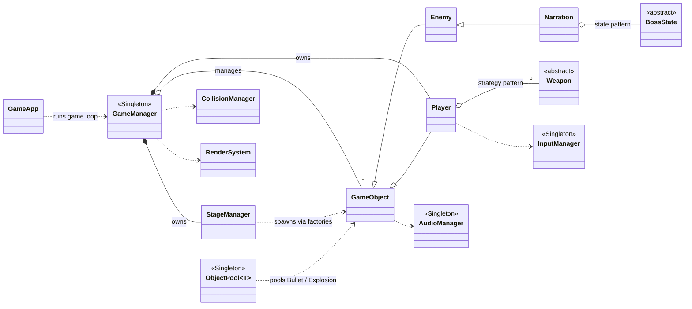

# 京城 97 (Gyeongseong 97) — 클래스 다이어그램

실제 소스 코드(`Gyeongseong97/*.h`)를 기준으로 작성한 Mermaid 클래스 다이어그램입니다.
규모가 커서 주요 클래스 단위로 문서를 분리했으며, GitHub에서 각 파일을 열면 다이어그램이 자동 렌더링됩니다.

## 문서 구성

| 영역 | 문서 | 주요 클래스 |
| --- | --- | --- |
| 핵심 시스템 | [core-system.md](core-system.md) | `GameApp`, `GameManager`, `InputManager`, `RenderSystem`, `CollisionManager`, `Utility` |
| 게임 오브젝트 | [game-objects.md](game-objects.md) | `GameObject`, `Player`, `Enemy` 계열, `Bullet`, `Explosion`, `WeaponItem` |
| 보스 상태 (State 패턴) | [boss-state.md](boss-state.md) | `BossState` + 9개 구체 상태, `Narration` |
| 무기 (Strategy 패턴) | [weapons.md](weapons.md) | `Weapon` + 5종 무기 |
| 지원 시스템 / 데이터 | [systems-and-data.md](systems-and-data.md) | `StageManager`, `AudioManager`, `ObjectPool`, 팩토리, 구조체/열거형 |

## 전체 조감도

각 영역과 그 사이의 핵심 관계만 추린 상위 수준 다이어그램입니다. 세부 멤버는 위 개별 문서를 참고하세요.

## 설계 패턴 요약

- **Singleton**: `GameManager`, `InputManager`, `AudioManager`, `ObjectPool<T>`
- **State**: 보스 `Narration`이 `BossState`의 9개 구체 상태를 전환하며 행동
- **Strategy**: `Weapon` 추상 클래스의 `Shoot()`을 5종 무기가 각자 구현, `Player`가 런타임에 교체
- **Factory**: `EnemyFactory`, `ItemFactory`가 스폰 데이터를 받아 객체 생성
- **Object Pool**: `ObjectPool<T>`로 `Bullet`, `Explosion` 재활용

## 표기 규칙

- 가시성: `+` public, `-` private, `#` protected
- `$` 접미사: 정적(static) 멤버 · `*` 접미사: 추상(순수가상) 메서드
- 관계: 상속 `<|--`, 합성 `*--`, 집약 `o--`, 의존 `..>`
- 타입은 가독성을 위해 단순화했습니다 (예: `shared_ptr<Weapon>` → `Weapon`).
