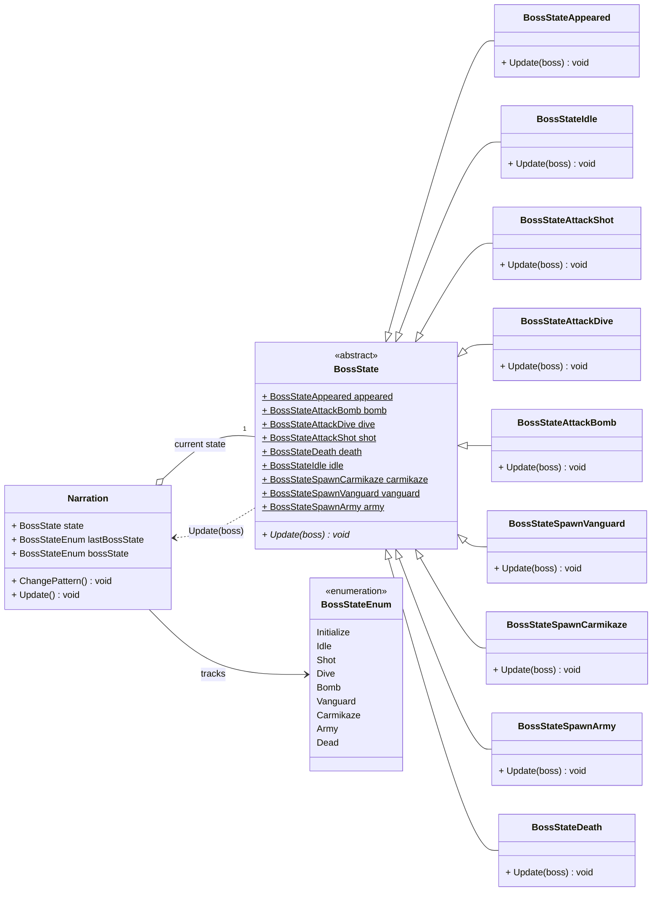

# 보스 상태 (Boss State — State 패턴)

최종 보스 `Narration`(나레이션 양반)의 행동을 **State 패턴**으로 구현한 영역입니다.

- 추상 클래스 **`BossState`**가 순수가상 `Update(Narration&)`을 선언하고, 9개 구체 상태가 각자의 패턴을 구현합니다.
- 각 구체 상태는 `BossState`의 **정적 인스턴스**(`appeared`, `idle`, `shot`, ...)로 보관되어 싱글톤처럼 재사용됩니다.
- `Narration`은 현재 상태를 `BossState* state`로 들고 있으며 `ChangePattern()`으로 상태를 전환합니다.

| 상태 클래스 | 역할 |
| --- | --- |
| `BossStateAppeared` | 등장 연출 |
| `BossStateIdle` | 대기 |
| `BossStateAttackShot` | 사격 패턴 |
| `BossStateAttackDive` | 돌진 패턴 |
| `BossStateAttackBomb` | 폭탄 패턴 |
| `BossStateSpawnVanguard` | 전위대 소환 |
| `BossStateSpawnCarmikaze` | 자동차 소환 |
| `BossStateSpawnArmy` | 인민군 소환 |
| `BossStateDeath` | 사망 처리 |

> `Narration`이 `Enemy` → `GameObject`를 상속하는 계층은 [game-objects.md](game-objects.md) 참고.
