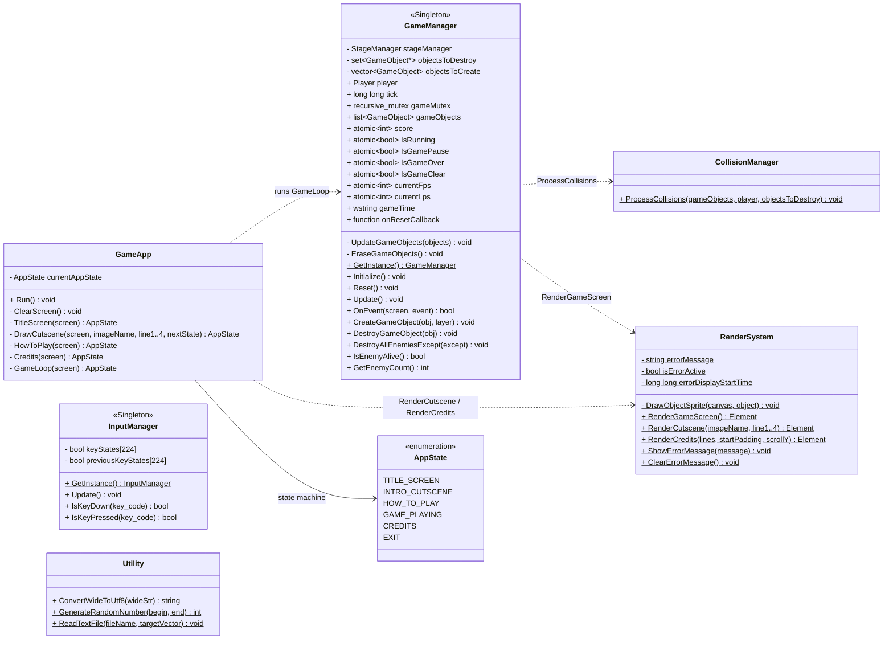

# 핵심 시스템 (Core System)

게임 애플리케이션의 진입점과 메인 루프, 입력·렌더·충돌·유틸리티를 담당하는 영역입니다.

- **`GameApp`**: 애플리케이션 진입점. `AppState`에 따라 타이틀/컷씬/도움말/크레딧/게임 루프 화면을 전환.
- **`GameManager` (Singleton)**: 게임 핵심 루프. 모든 `GameObject`를 `list`로 관리하고 `Player`·`StageManager`를 직접 소유.
- **`InputManager` (Singleton)**: WinAPI 기반 키 입력 상태 추적.
- **`RenderSystem`**: FTXUI 기반 화면 렌더링 (정적 유틸).
- **`CollisionManager`**: 게임 오브젝트 간 충돌 처리 (정적 유틸).
- **`Utility`**: 문자열 변환·난수·파일 읽기 등 보조 함수 (정적 유틸).

> 게임 오브젝트 계층과의 관계(`GameManager`가 `Player`/`GameObject`를 소유)는 [game-objects.md](game-objects.md) 참고.
