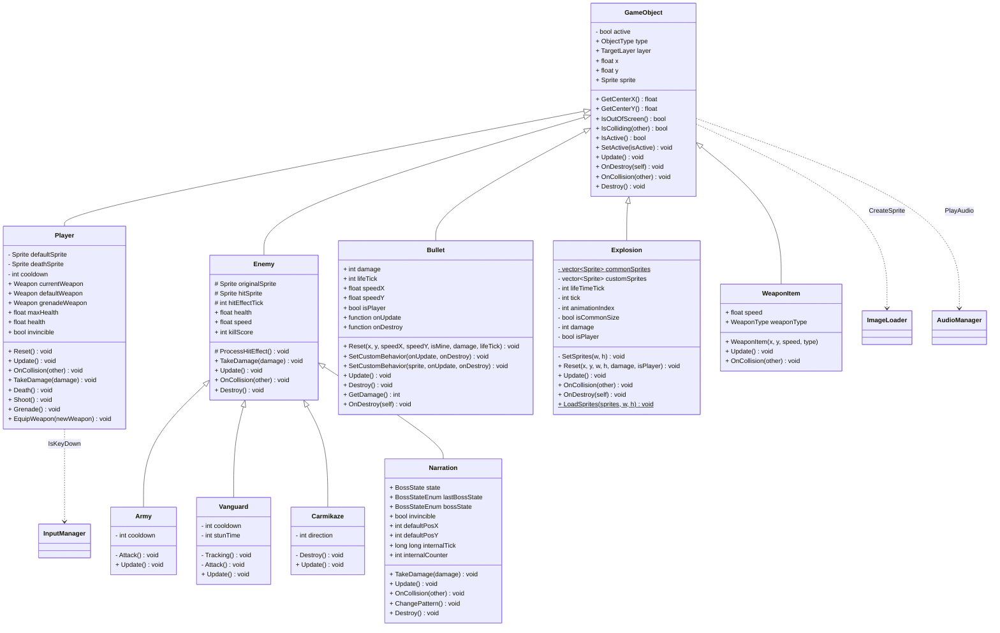

# 게임 오브젝트 (Game Objects)

화면에 존재하는 모든 개체의 기반 클래스 `GameObject`와 그 상속 계층입니다.

- **`GameObject`**: 모든 게임 개체의 기반 클래스. 위치·스프라이트·충돌·생명주기(`Update`/`OnDestroy`/`Destroy`)를 정의.
- **`Player`**: 김두한. 무기 3종(현재/기본/수류탄)을 보유하고 입력에 따라 이동·사격.
- **`Enemy`**: 적의 기반 클래스. 체력·속도·점수 및 피격 이펙트 처리. `Army`, `Vanguard`, `Carmikaze`, 보스 `Narration`이 상속.
- **`Bullet`**: 총알. 콜백(`onUpdate`/`onDestroy`)으로 유도탄·폭발 등 특수 동작 부여 가능. (풀링 대상)
- **`Explosion`**: 폭발 이펙트 + 범위 피해. (풀링 대상)
- **`WeaponItem`**: 떨어지는 무기 아이템. 획득 시 플레이어 무기 교체.

> 보스 `Narration`의 상태 패턴 상세는 [boss-state.md](boss-state.md), 무기 시스템은 [weapons.md](weapons.md) 참고.

