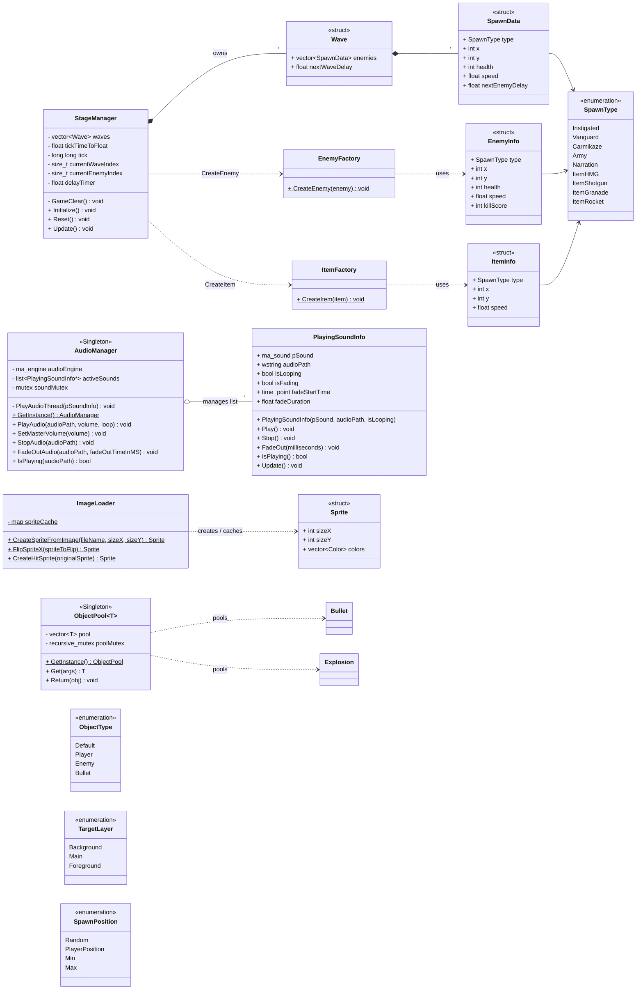

# 지원 시스템 / 데이터 (Systems & Data)

스테이지 진행, 객체 풀링, 오디오, 이미지 로드, 팩토리, 그리고 게임 전반에서 쓰이는 구조체·열거형 모음입니다.

- **`StageManager`**: 웨이브 기반 스테이지 진행. `Wave`/`SpawnData`를 읽어 팩토리로 적·아이템을 스폰하고, 모두 처치 시 `GameClear()`.
- **`EnemyFactory` / `ItemFactory`**: 스폰 데이터를 받아 적·아이템 객체를 생성 (Factory).
- **`ObjectPool<T>` (Singleton)**: `Bullet`·`Explosion` 등 빈번히 생성/파괴되는 객체를 재활용.
- **`AudioManager` (Singleton)**: miniaudio 기반 사운드 재생/페이드. `PlayingSoundInfo`로 개별 사운드를 추적.
- **`ImageLoader`**: stb 기반 이미지 → `Sprite` 변환 및 캐싱 (정적 유틸).

> 팩토리가 생성하는 `Enemy`/`WeaponItem`, 풀링 대상 `Bullet`/`Explosion`의 정의는 [game-objects.md](game-objects.md), 스테이지를 구동하는 `GameManager`는 [core-system.md](core-system.md) 참고.
