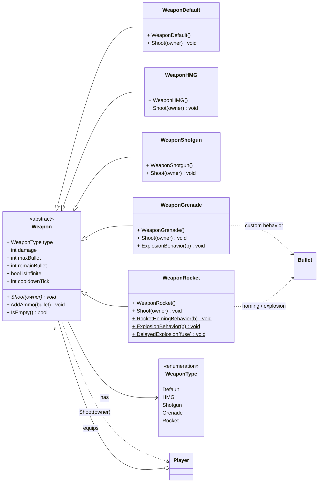

# 무기 (Weapons — Strategy 패턴)

플레이어의 무기 시스템을 **Strategy 패턴**으로 구현한 영역입니다.

- 추상 클래스 **`Weapon`**이 순수가상 `Shoot(Player*)`을 선언하고, 5종 무기가 각자의 발사 로직을 구현합니다.
- `Player`는 `currentWeapon`/`defaultWeapon`/`grenadeWeapon` **3개의 무기 슬롯**을 보유하며, `EquipWeapon()`으로 현재 무기를 교체합니다.
- `WeaponGrenade`·`WeaponRocket`은 `Bullet`의 콜백에 연결할 **정적 동작 함수**(폭발·유도)를 제공합니다.

| 무기 | 설명 |
| --- | --- |
| `WeaponDefault` | 기본 무기 (무한 탄약) |
| `WeaponHMG` | 중기관총 |
| `WeaponShotgun` | 산탄총 (확산) |
| `WeaponGrenade` | 수류탄 (착탄 폭발) |
| `WeaponRocket` | 로켓 (유도 + 지연 폭발) |

> 무기를 장착하는 `Player`의 상세는 [game-objects.md](game-objects.md), 떨어지는 무기 아이템 `WeaponItem`도 동일 문서를 참고.
